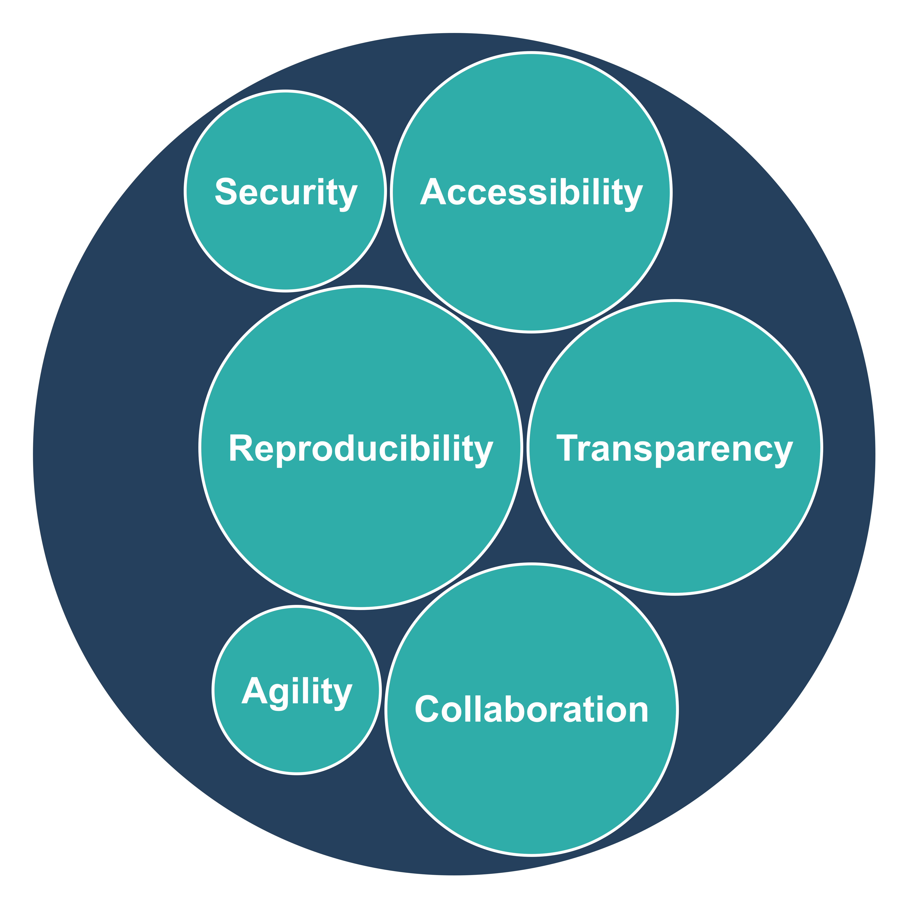
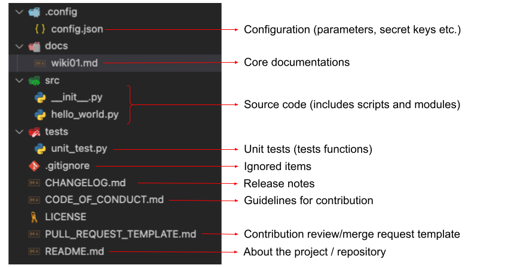
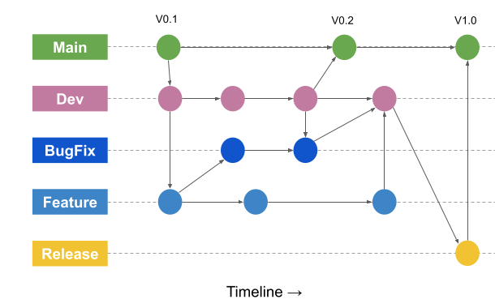
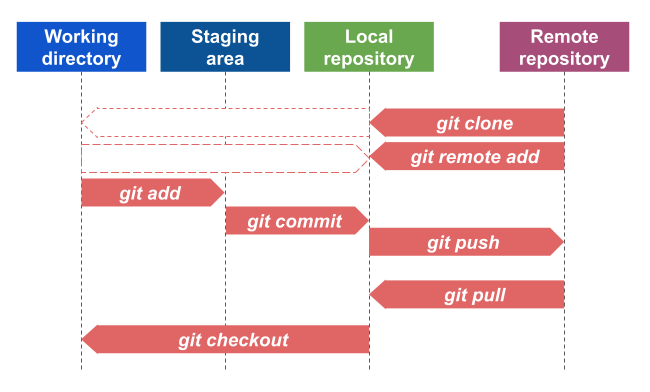

# git-tutorial-for-biological-research

A repository for learning git version control system.


## What is version control?

Version control is a system that tracks changes to a file or set of files over time. It allows users to collaborate on a file, track changes made by different users, and revert to previous versions of the file if necessary. Common version control systems include Git, Mercurial, and Subversion.

## A brief history of version control systems:

The earliest version control systems were developed in the 1970s and 1980s, with notable examples including the Source Code Control System (SCCS) and Revision Control System (RCS). These systems were primarily used by software developers to manage the source code of their programs.

In the late 1990s and early 2000s, distributed version control systems (DVCS) were introduced, such as Git and Mercurial. These systems allowed multiple developers to work on the same codebase simultaneously, without the need for a central repository. This made collaboration and branching (creating a copy of the code to work on a new feature) much easier.

In recent years, cloud-based version control systems such as GitHub, GitLab and Bitbucket have become popular, which provide a web-based interface for managing code and collaboration.

Overall, version control systems have evolved from centralized systems that were primarily used by software developers to distributed systems that are widely used across many industries for managing and collaborating on all types of files, not just code.


## Importance of version control in biological research

Version control systems are important in biological research for several reasons:

Collaboration: Researchers often work in teams and need to share data and code with one another. Version control systems make it easy to collaborate on a project and keep track of who made what changes.

Reproducibility: In science, it is important to be able to reproduce the results of a study. Version control systems allow researchers to keep track of the exact versions of data and code used to generate a result, making it easier to reproduce the study later on.

Data Management: Biomedical research generates large amounts of data. Version control systems can be used to manage and track different versions of data, making it easy to keep track of what data was used for a particular analysis and to ensure data integrity.

Experiment tracking: Version control systems can be used to keep track of different versions of an experiment. Researchers can see the evolution of an experiment and can easily revert to an older version of the experiment if necessary.

Open Science: Version control systems can be used to make research more open and transparent. By making data and code publicly available via version control systems, researchers can allow other scientists to reproduce and verify their results.

In summary, version control systems can help researchers work more efficiently, make research more reproducible, and increase the transparency and openness of research. This can lead to better scientific output and more trust in the research.

{ width=50% }

## `Git`: The algorithm

Git is a distributed version control system that uses a unique algorithm for tracking changes to files. The algorithm is based on a data structure called a "directed acyclic graph" (DAG), which is a graph that does not contain any cycles.

In Git, each file is represented by a unique hash value, which is generated by a cryptographic algorithm called SHA-1. This hash value serves as a "fingerprint" for the file, and it is used to identify the file in the Git repository.

When a file is modified, a new hash value is generated for the new version of the file. This new hash value is then linked to the previous hash value in the DAG, creating a chain of hash values that represent the history of the file.

Git also uses a concept called "branches" which allows multiple versions of the same file to be developed simultaneously. Each branch is represented by a pointer in the DAG, and when a new version of a file is created on a branch, a new pointer is added to the DAG.

When changes made on a branch need to be incorporated into the main branch, Git uses a process called merging, which creates a new version of the file by combining the changes from both branches.

Because of its use of hash values and DAG, Git is a very efficient algorithm for tracking changes to files. It allows for fast and easy collaboration, versioning, and rollback, and it is also very efficient in terms of storage space.

```text
# pseudocode
While {
 	hash_mismatch(hash_01, hash_01.1)
}; do {
	delta = compute_delta(hash_01, hash_01.1)
	updates = store_delta(delta)
	tree = compute_tree_nodes(updates)
	project = update_tree(tree)
	compute_patch_model(project)
}

```

## A generic `git` project structure



## A typical git workflow

* Initialize a new Git repository: This creates an empty repository on the local machine or a remote server where all the code and files will be stored and tracked.

    ```bash
    #!/usr/bin/bash
    # initialize a local project
    cd myproject
    git init
    # create a remote repository in GitHub
    # for example, your remote project is
    # https://github.com/username/myproject.git
    # add remote origin to your local repository
    $ git remote add origin https://github.com/username/myproject.git

    # verify the remote repository
    git remote -v
    ```

* Make changes to files: Once the repository is set up, developers can make changes to the files in the repository. These changes can include adding new files, modifying existing files, or deleting files.

    ```bash
    #!/usr/bin/bash
    # check the status of the tracker
    git status
    ```

* Stage the changes: Before the changes can be committed, they need to be "staged" which means selecting which changes should be included in the next commit.

    ```bash
    #!/usr/bin/bash
    # exmple: adding a file: myfile.txt
    git add myfile.txt
    # stage specific file types
    git add *.txt
    # stage all changes
    git add .
    ```

* Commit the changes: After the changes have been staged, developers can "commit" the changes. This creates a new snapshot of the repository that includes all the changes that were staged.
    
    ```bash
    #!/usr/bin/bash
    git commit -m "added myfile.txt"
    ```

* Push the changes: If the repository is hosted on a remote server (such as GitHub, GitLab), developers can "push" the changes to the remote repository, which makes the changes available to other collaborators.

    ```bash
    #!/usr/bin/bash
    # pushing changes to the remote repository
    git push -u origin main
    # pushing changes to a specific branch on remote
    git push -u origin <branchname>
    ```

* Create a branch: Developers can create a new branch to work on a new feature, fix a bug or to test something. This allows developers to work on multiple versions of the codebase simultaneously without affecting the main branch.

    ```bash
    #!/usr/bin/bash
    # create a new branch
    git branch myfeature 
    # switch to abranch
    git checkout myfeature
    # create branch and switch simultaniously
    git checkout -b myfeature
    # push to a branch
    git push -u origin myfeature
    # check existing branches on local
    git branch
    # check existing branches on remote
    git branch -r
    ```

    

* Merge the branches: When the changes made on a branch are ready, they can be merged back into the main branch. This is typically done by creating a "pull request" which allows other developers to review the changes before they are merged into the main branch.

    ```bash
    #!/usr/bin/bash
    # switch to main branch
    git checkout main
    # merge a branch named myfeature
    git merge myfeature
    ```

* Synchronize with remote repository: Developers can synchronize their local repository with the remote repository to ensure that their codebase is up-to-date with the latest changes made by other collaborators.

    ```bash
    #!/usr/bin/bash
    # synchronize local repository when remote is ahead
    git pull origin main
    ```

    

## Further reading

* [Git Cheat sheet](https://education.github.com/git-cheat-sheet-education.pdf)

* [Git Book](https://git-scm.com/book/en/v2)
